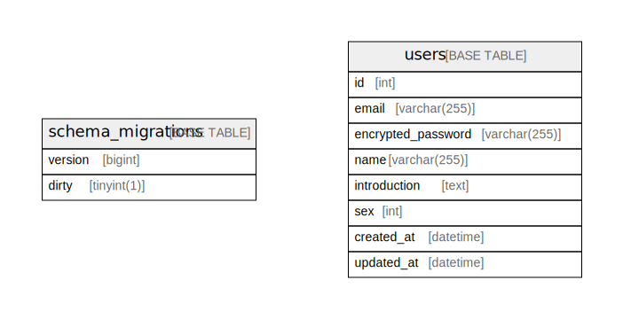

# auth_DB

## Tables

| Name | Columns | Comment | Type |
| ---- | ------- | ------- | ---- |
| [schema_migrations](schema_migrations.md) | 2 |  | BASE TABLE |
| [users](users.md) | 5 |  | BASE TABLE |

## Relations

---

> Generated by [tbls](https://github.com/k1LoW/tbls)
